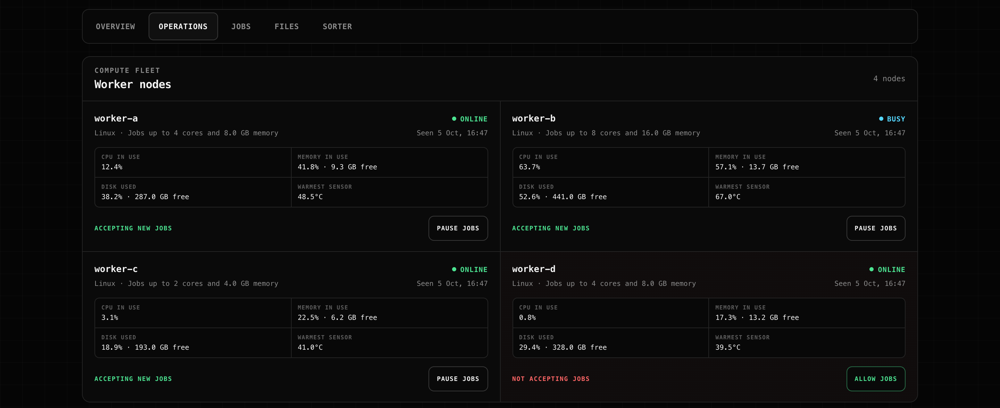
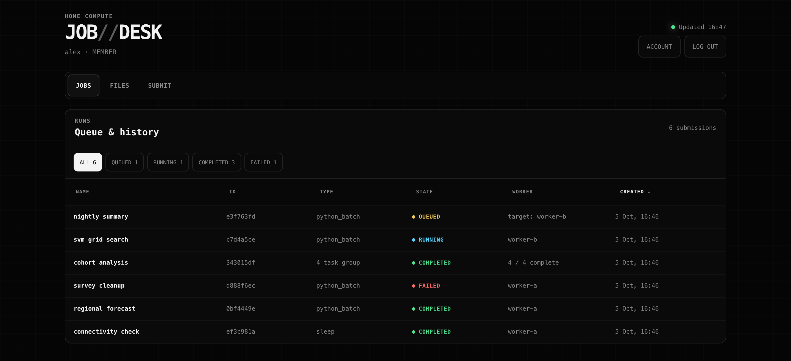

# Home Platform

A private homelab: several household services on a handful of ordinary
machines, reachable only from devices on a private network. One always-on host
is the front door and the coordinator; a NAS holds the files; laptops lend
compute when they are awake; and a Linux workstation also serves the household
media library.

The largest application is a distributed job system. It was built to explore
the parts of distributed systems that are easy to describe and hard to get
right: atomic work claiming, lease-based failure recovery, verifying data you
did not produce, and running untrusted code without trusting it. But it is one
tenant among several, and the platform around it is the point of the design.

Nothing is exposed to the public internet. No router port is forwarded and no
public tunnel is enabled.

## The whole system

```text
               people, on devices joined to the private overlay network
       browser  ·  command-line client  ·  file apps (SMB)  ·  media players
           |                 |                     |                  |
           | HTTPS           | HTTPS               | SMB              | HTTPS
           | host's name     | host's name         |                  | workstation's name
           v                 v                     |                  v
  +--------------------------------------+         |    +----------------------------+
  | ALWAYS-ON HOST                       |         |    | LINUX WORKSTATION          |
  |                                      |         |    |                            |
  |  reverse proxy: TLS, caller identity |         |    |  reverse proxy: TLS only   |
  |    /           launcher, jobs, API   |         |    |    /   media server        |
  |    /habits     habit tracker         |         |    |        (its own logins)    |
  |    /wishlist   wishlist              |         |    |                            |
  |    /transport  transport             |         |    |  worker agent, polls the   |
  |    /sorter     file sorter           |         |    |  host like any laptop      |
  |  local disk: one SQLite db per app   |         |    +----------------------------+
  +--------------------------------------+         |                   |
       ^                   |                       |                   | read-only
       | workers poll:     | mounts: results,      |                   | mount
       | claim, heartbeat, | member files,         |                   |
       | report            | backups, owner files  |                   |
       |                   v                       v                   v
  +-----------+   +------------------------------------------------------------------+
  | laptops   |   | NAS: the only file server                                        |
  |           |   |   Home, Shared   members' files                                  |
  | worker    |   |   Artifacts      published job results, owned by the coordinator |
  | agent +   |   |   Backups        verified database copies, owner-only            |
  | per-job   |   |   Media          films and video, read-only to the media server  |
  |           |   |   Personal       the owner's library, organized by the sorter    |
  | containers|   +------------------------------------------------------------------+
  +-----------+
```

Read it top to bottom:

- **Clients** are people's own devices: a browser, the command-line client, a
  file app speaking SMB, or a media player. All of them must first join the
  private overlay network (Tailscale); a device outside it cannot see anything.
- **Two HTTPS entrances.** Every machine on the overlay network has its own
  private name, and any of them can run a small reverse proxy that terminates
  HTTPS for that name. The always-on host's proxy is the main front door and
  routes by path. The workstation runs a second proxy for one thing only, the
  media server, so video streams never pass through the low-power host.
- **Backends bind to loopback.** Each application listens only on its own
  machine's `127.0.0.1`, so its proxy is the only way in. That is what lets the
  host's applications trust the caller identity the proxy attaches.
- **Databases live on the host's local disk,** one SQLite file per
  application, never on a network share, because SQLite's locking is not
  reliable over SMB. Each database is backed up online, verified, and copied to
  the NAS daily.
- **The NAS is the only file server.** People reach it directly over SMB and
  through the web Files view; the control plane mounts it for member files and
  job results; the media server mounts one share read-only.
- **Workers connect outward.** Laptops and the workstation poll the host to
  claim work, renew leases, and report results. Nothing connects in to them, so
  they need no open port and can come and go freely.

## What runs where

| Component | Runs on | Reached through | Its data lives |
|---|---|---|---|
| Reverse proxy | Always-on host | The host's private HTTPS name | Routing configuration only |
| Control plane: launcher, dashboard, Job Desk, API, scheduler | Host | Proxy `/` | SQLite on the host; files and results on the NAS |
| Habit tracker | Host, own container | Proxy `/habits` | Its own SQLite on the host |
| Wishlist | Host, own container | Proxy `/wishlist` | Its own SQLite on the host |
| Transport dashboard | Host, own container | Proxy `/transport` | Its own SQLite on the host |
| File sorter | Host, own container | Proxy `/sorter`, administrator session only | Its own SQLite on the host; the files themselves on the NAS |
| Database backups | Host, scheduled | — | Verified copies on the NAS, owner-only |
| Compute workers | Laptops and the workstation | They poll the host | A bounded local input cache; results are published through the host |
| Media server | Workstation, own container | The workstation's own private HTTPS name | Settings on the workstation; media read-only from the NAS |
| File server | NAS | SMB, or the web Files view | Home, Shared, Artifacts, Backups, Media, Personal |

Each application is an independent container with its own port, database,
backup, and lifecycle. They share the host, the proxy, and one identity system,
never a database. See [Architecture](docs/architecture.md) for the full
overview and [Network](docs/network.md) for how requests are routed.

## The compute system

One coordinator owns job state in SQLite, and queued work waits when no worker
is online.

- **Durable job queue** — SQLite is the single source of truth. Workers mutate
  state only through the API.
- **Lease-based recovery** — a claimed job carries a renewable lease. If a
  worker sleeps or dies, the job is requeued automatically, bounded by an
  attempt limit so a poisonous job fails instead of looping forever.
- **Atomic claiming** — a single conditional update means exactly one worker
  wins a job, even under contention.
- **Content-addressed data plane** — large datasets go straight to the worker
  that needs them, verified by size and SHA-256 and cached by digest. They never
  travel through the coordinator or sit in job rows.
- **Isolated execution** — user-supplied Python runs in a fixed, pre-built
  container with no network, a read-only root, dropped capabilities, a non-root
  user, and CPU/memory/PID/time limits. The host agent never imports it.
- **PBS-style numeric arrays** — one bounded project contains a strict `#HP`
  Bash wrapper and its child scripts. An inclusive array range becomes one
  durable parent plus independently placed, retried, and collected children.
  Named inputs may be small uploads or verified HTTPS files downloaded directly
  and cached by each selected worker. Projects and inputs already on the NAS are
  selected by logical `Home/...` or `Shared/...` path — the same vocabulary in
  Job Desk, the CLI, and `#HP` defaults, for both job types.
- **Result publishing** — a worker uploads its output files to the coordinator
  under the same lease that authorises completion, so a revived worker cannot
  overwrite its replacement's results. The coordinator, not the script, decides
  where they land: one directory per submission, named after the job, with array
  children nested inside it. Files can then be previewed or downloaded from Job
  Desk, or read from the file share.
- **Deliberate throttling** — `cpu_limit` is a hard quota, not a priority, and
  accepts fractions. A long search at 0.5 CPU runs slowly and coolly on a laptop
  you are still using. Library thread pools are pinned to the quota, without
  which a throttled job oversubscribes its own limit and runs several times
  slower for the same CPU budget.
- **Operator control** — workers register scheduling-disabled and are enabled
  deliberately, from a web dashboard or the CLI. Disabling drains gracefully
  rather than cancelling running work.
- **User-scoped Job Desk** — members sign in with individual credentials and
  can access only their own jobs, groups, staged uploads, and artifacts.
- **Separate operator control plane** — the owner monitors every workload,
  manages bounded file areas plus worker, host, and account controls, and has no
  browser submission path. Members can change their password, while an owner
  reset revokes every existing member session.
- **Guarded host power control** — the owner dashboard can request reboot or
  shutdown only after all workers are drained and jobs are idle. A root-owned
  helper flushes writes and unmounts local removable storage before changing
  power state.
- **Cooperative cancellation** — queued work stops immediately; a running
  container receives cancellation through its lease heartbeat and is removed
  without conflating the outcome with timeout or memory exhaustion.

Detail: [Compute](docs/compute/README.md).

## Household applications

Small, long-running applications that have nothing to do with jobs. Each has
its own container, database, and backup, and resolves who is calling through
the shared identity system.

- **Habit tracker** (`/habits`) — one app with Overview, Water, Budget, and
  Study pages: classified drinks, daily spending against an allowance with a
  sinking fund, and focus sessions.
- **Wishlist** (`/wishlist`) — tracks what things cost over time. It reads
  other people's shops, which can hang or change without notice, so it is kept
  apart from everything else.
- **Transport** (`/transport`) — a personal last-train and bus-arrival view.
  It calls its upstream provider only when a card is refreshed.
- **File sorter** (`/sorter`) — works through an unsorted downloads folder one
  item at a time: preview, choose a destination folder, next. Each choice is
  a server-side move on the NAS and a logged routing label, building training
  data for a classifier that may later suggest destinations. Only the
  administrator's dashboard session may use it.

Detail: [Application services](docs/services.md).

## Media

A Jellyfin media server runs on the Linux workstation rather than on the
always-on host, because playing and transcoding video needs CPU and bandwidth
the host should keep for coordination. It reads a dedicated NAS share through a
read-only mount with its own read-only file-server account, keeps its settings
on the workstation's disk, and is published on the workstation's own private
HTTPS name. It has its own logins and does not use the platform's identity
system.

Detail: [Media](docs/media.md).

## Interfaces

The browser UI has five focused routes: owner Overview, owner Operations, job
history/results, Files, and Submit. They retain one terminal-inspired visual
language and one responsive 1240 px content shell without forcing monitoring,
destructive controls, forms, and history into one screen. Submission uses a
roomy two-column form on larger screens and a single-column phone layout.

### Homelab Dashboard



### Job Desk



The screenshots use synthetic host, worker, job, and timestamp values so the
public repository does not disclose details of the live deployment.

## Documentation

- [Architecture](docs/architecture.md) — the overview: physical shape, where
  each piece and its data live, trust boundaries, failure behaviour, known
  limits.
- [Network](docs/network.md) — the private overlay network, reverse
  proxy routing, and why a loopback binding is what makes proxy identity
  headers trustworthy.
- [Compute](docs/compute/README.md) — the job engine: leases, atomic claiming,
  placement, data plane, isolation. With its
  [wire contract](docs/compute/job-contract.md) and authoring guides for
  [Python scripts](docs/compute/python-script.md) and
  [batch projects](docs/compute/batch-script.md).
- [Storage](docs/storage/README.md) — one file server, logical areas, published
  results, backups, and [files in and out of a job](docs/storage/workflow.md).
- [Accounts and access control](docs/access-control.md) — roles, sessions,
  immutable ownership, and linking a network login to a platform account.
- [Application services](docs/services.md) — independent containers,
  proxy routing, and state ownership for hosted household applications.
- [Media](docs/media.md) — the media server on the workstation, its read-only
  view of the NAS, and its separate private entrance.
- [Configuration](docs/configuration.md) — control-plane, storage, worker, and
  execution settings.

## Layout

```text
contracts/   the shared wire contract — the only code both sides import
app/         control plane: HTTP API, persistence, migrations, web interfaces
worker/      worker agent: claiming, telemetry, dataset cache, container launcher
cli/         operator client
containers/  pinned container image definition for batch execution
examples/    model-training and PBS-style numeric-array examples
services/    independently deployed household applications
tests/       test suite
```

`contracts/` exists so a worker deployment does not drag control-plane code
along with it. Nothing in `app/` imports `worker/`, and neither `worker/` nor
`cli/` imports `app/`.

## Development

```bash
pixi run dev      # API on localhost, interactive docs at /docs
pixi run check    # lint, format, strict type check, tests
```

`/health` reports process liveness; `/ready` also verifies the database is
reachable.

## Running a worker

```bash
HOME_PLATFORM_API_URL=<control-plane-url> \
HOME_PLATFORM_WORKER_ID=<worker-name> \
pixi run -e worker worker
```

The lock includes native x86-64 Linux workers. A Linux worker can run under a
systemd user service, starts with that user's login, registers
scheduling-disabled, and advertises container job types only after the approved
runtime image is actually available.

A worker advertises the batch capability only once it can see the pre-built
container image, re-checking periodically — so capability appears and
disappears on its own, without restarts.

The retired CSV Summary handler is no longer submittable or advertised. The
single-file `python_batch` remains available while the compute layer evolves
toward the general PBS-style batch design described in the
[architecture](docs/architecture.md) and its normative
[batch script standard](docs/compute/batch-script.md).

## Client

```bash
export HOME_PLATFORM_API_URL=<control-plane-url>

pixi run client workers                       # readable table; --json to pipe
pixi run client worker-capacity <worker-name> --cpus 4 --memory-mb 4096
pixi run client worker-enable <worker-name>
pixi run client submit-python-batch script.py data.csv --name "Training run" \
  --worker <worker-name> --cpus 0.5 --timeout-seconds 86400
# Or keep a large dataset off the coordinator:
pixi run client submit-python-batch script.py --name "Large training run" \
  --dataset-url <https-url> --dataset-sha256 <sha256> \
  --dataset-size-bytes <bytes> --timeout-seconds 604800
# The same direct-input pattern works for a PBS-style project array:
pixi run client submit-batch ./experiment \
  --input-url data=<https-url> --input-sha256 data=<sha256> \
  --input-size-bytes data=<bytes>
# Or bind a file already on the NAS, by logical path:
pixi run client submit-batch ./experiment \
  --input-storage data=Shared/Datasets/dataset.csv
pixi run client submit-python-batch script.py --name "From the NAS" \
  --dataset-storage Shared/Datasets/dataset.csv
pixi run client list
pixi run client cancel <job-id>
pixi run client artifacts <job-id>            # what the job produced
pixi run client download <job-id> model.joblib
pixi run client pull <job-id> --destination ./results  # resume + verify all
pixi run client delete <job-id>               # remove its files; job record stays
```

Output is human-readable by default and raw JSON behind `--json`.
`pixi run client --help` lists every command with its arguments.

## Status and scope

A working personal system, not a product. It runs a single coordinator with a
single database writer and is deliberately not highly available.

Known gaps, in the order they will start to matter: automatic placement uses
fixed per-node capacity rather than live load, thermal, or data-locality policy;
artifact publication still passes through the coordinator in one bounded
request per file; and browser downloads do not expose the CLI's resumable
manifest workflow. Worker input caches now have a least-recently-used size
ceiling, and CLI artifact pulls resume by byte range and verify SHA-256. See
[Architecture](docs/architecture.md) for why each is currently adequate and
when it stops being so.

Deployment specifics — hosts, addresses, accounts, machine inventory, and
operational runbooks — are intentionally kept out of public version control.
